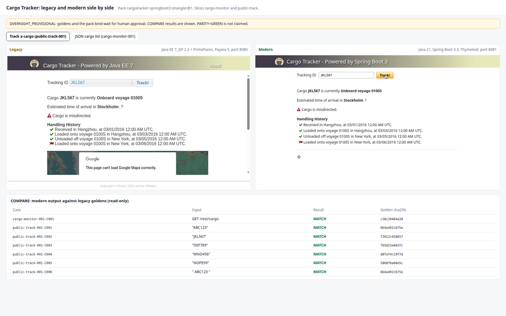
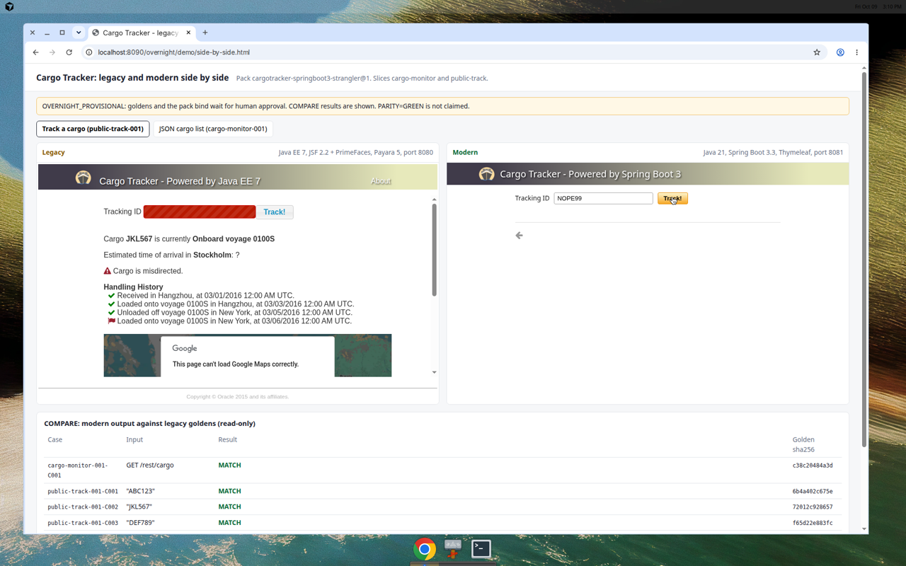
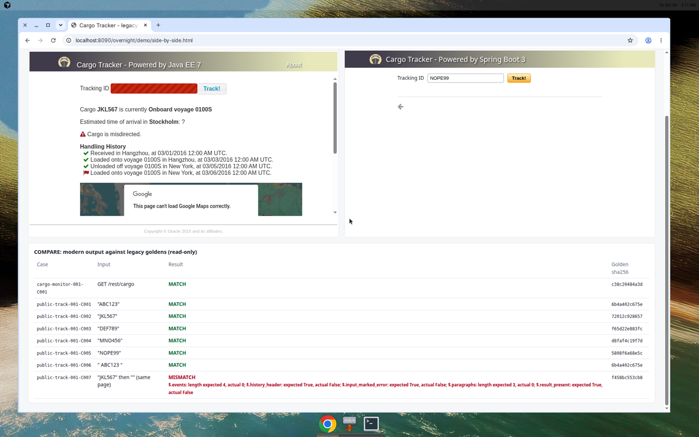

# Side-by-side demo

Left is the Java EE 7 app. Right is the Spring Boot 3 app.

Valid id `JKL567`. Both sides show the same status, ETA, misdirection warning, and handling history.



Same page, then an unknown id. Legacy keeps the previous cargo and marks the input red. Modern clears the result. That is case `public-track-001-C007`.



Automated compare of the modern app against the legacy goldens: 7 MATCH, `public-track-001-C007` MISMATCH.



The legacy page also embeds a Google Map. The modern page does not. The compare checks cargo fields, not that widget.

The HTML viewer below only works where both apps are running. The pictures above are the comparison.

Three processes. Paths match the overnight VM; change them for your machine.

```bash
# 1. Legacy (Java EE 7 on Payara 5, JDK 11, port 8080)
export AS_JAVA=/opt/tools/jdk-11.0.32.1+1
/opt/tools/payara5/bin/asadmin start-domain
/opt/tools/payara5/bin/asadmin deploy --contextroot cargo-tracker --force=true target/cargo-tracker.war

# 2. Modern (Spring Boot 3 on Java 21, port 8081)
mvn -f modern/pom.xml -B -DskipTests package
java -Duser.timezone=UTC -jar modern/target/cargo-tracker-modern.jar

# 3. Viewer (port 8090, serve from the repository root)
python3 -m http.server 8090
# open http://localhost:8090/overnight/demo/side-by-side.html
```

Legacy setup notes (one time): see overnight/CONTEXT_GATE.md (Derby jar, theme jar, https mirrors, X-Frame-Options off, JVM time zone UTC).
